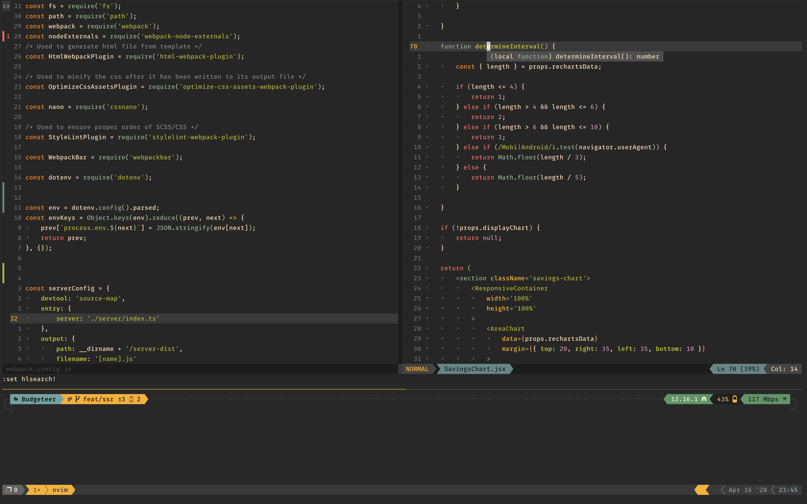

# Dotfiles

## About

This repo is a collection of all my dotfiles for neovim, tmux and zsh. This repo contains my `.vimrc`, `.tmux.conf` and my `.zshrc`. I also use `oh-my-zsh`.

Vim related settings are configured to use neovim to leverage the built in LSP functionality. The .vimrc is **not** compaitible with vim or neovim <= 0.4.x.

## Installation

To install simply run:
`curl https://raw.githubusercontent.com/sbernheim4/dotfiles/master/scripts/install.sh | bash`

Be sure to also install the font in the `fonts/` folder and use this font as the default for your terminal. Do not use a separate font for non-ascii characters.

## What Gets Installed
- brew
- git
- neovim
- tmux
- zsh
- fzf
- bat
- icdiff
- shpotify
- ripgrep
- delta
- colorls
- n (faster nvm alternative)
- node
- oh-my-zsh
- tldr
- vtop
- powerlevel10k
- Plus configs for neovim, tmux, and zsh

zsh will be set to be the default shell. Symlinks will be set up for all config files (probably)

Be sure to install the font in `fonts/`and set this to be the default font for your terminal.

## Installation Notes

Your computer password is needed to change shells which is a sudo operation

## Screenshots

