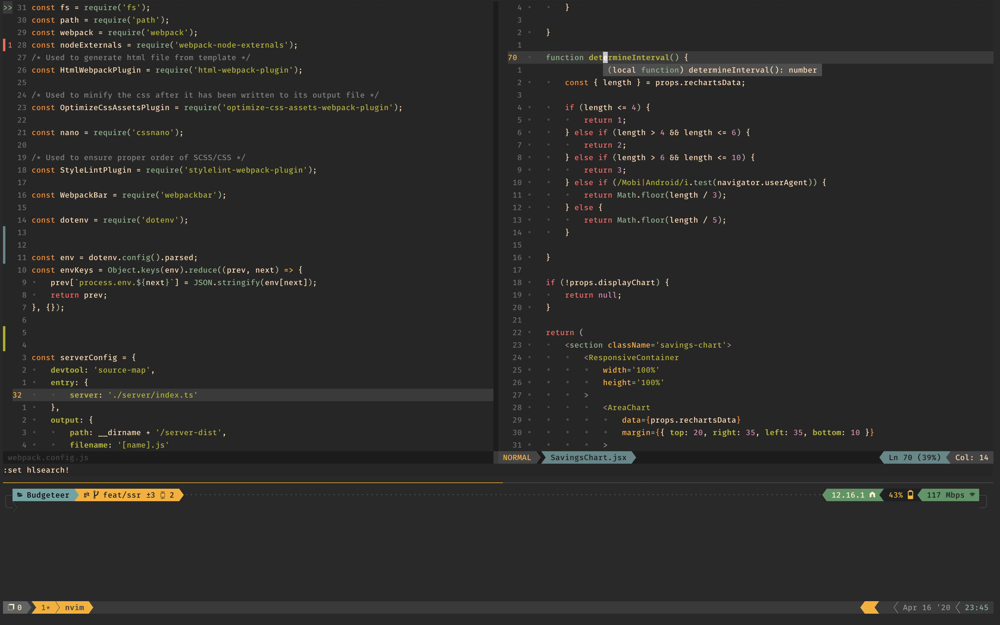

# Dotfiles

## About

This repo is a collection of configuration for Neovim, tmux, Zellij, and Zsh. It also contains terminal assets and small tmux status scripts. Oh My Zsh, Powerlevel10k, and the Zsh syntax-highlighting plugin are installed as external dependencies.

Neovim is configured through `nvim/init.lua` and the modules under `nvim/lua/`.

## Installation

To install simply run:
`curl -fsSL https://raw.githubusercontent.com/sbernheim4/dotfiles/master/scripts/install.sh | bash`

Be sure to also install a font from `terminal/fonts/` and use it as the default for your terminal. Do not use a separate font for non-ASCII characters.

## What Gets Installed
- brew
- git
- neovim
- tmux
- zsh
- fzf
- fd
- bat
- icdiff
- shpotify
- ripgrep
- delta
- Rust/Cargo via rustup
- jj and jjui
- GitHub CLI, jq, bc, direnv, Go, and uv
- colorls
- n (faster nvm alternative)
- node
- oh-my-zsh
- tldr
- vtop
- powerlevel10k
- Plus configs for neovim, tmux, Zellij, and zsh

Zsh will be set as the default shell. The installer creates a symlink for the complete Neovim configuration at `~/.config/nvim`, plus links for the tmux, Zellij, and Zsh configuration files.

Be sure to install a font in `terminal/fonts/` and set it as the default for your terminal.

To update the installation, run `scripts/update.sh` from the checkout. To unlink the files created by the installer without deleting the checkout, run `scripts/cleanup.sh`.

## Installation Notes

Your computer password is needed to change shells which is a sudo operation

## Screenshots

